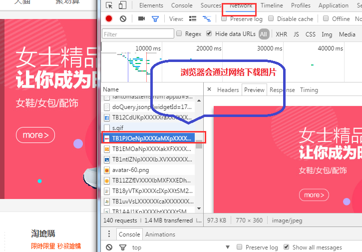

> 本章目标

- 认识一些常见的HTML标签
- 用更多标签定义复杂网页

# 1. 在网页上显示文字标题

 &emsp;&emsp;\<h1\> - \<h6\> 标签可定义标题。<h1> 定义最大的标题。<h6> 定义最小的标题。

    <!DOCTYPE HTML PUBLIC "-//W3C//DTD HTML 4.01//EN" "http://www.w3.org/TR/html4/strict.dtd">
    <HTML>
    <BODY>
    <h1>This is heading 1</h1>
    <h2>This is heading 2</h2>
    <h3>This is heading 3</h3>
    <h4>This is heading 4</h4>
    <h5>This is heading 5</h5>
    <h6>This is heading 6</h6>
    </BODY>
    </HTML>  

  [点击复制按钮并在打开新窗口粘贴、运行以上代码](/public/tiyEditor.html)  

# 2. 网页上的文字段落

## 2.1 如何标记文章段落
&emsp;&emsp;在HTML网页里面，文章段落会按照下面的方式进行标记：

    
This is some text in a paragraph.

&emsp;&emsp;起始的\<p\>标签在标记了一个文章段落在html中开始的位置，结束的\</p\>标签标记了段落结束的位置。这两个标签必须成对出现，如果按照严格的语法规则，起始和结束标签都不能缺少。

 
## 2.2 特性
&emsp;&emsp;如果一个页面上有多个段落同时出现，浏览器就会在一个段落之前、之后还有多个p标签之间插入换行和空格。

    <!DOCTYPE HTML PUBLIC "-//W3C//DTD HTML 4.01//EN" "http://www.w3.org/TR/html4/strict.dtd">
    <HTML>
    <BODY>
    <h1>演示段落标签大标题</h1>
    

    这个段落
    在源代码中
    包含了多次换行,
    但是浏览器在展示内容的时候
    只是按照一个段落来处理
    没有进行多次换行.
    

    

    这个段落
    在源代码中
    包含  了多个   空格
    但        是浏览器在    展示内容的时候并没有把源代码中的多个空    格显示出来。
    多个空格都被当成一个空格来显示了！
    

    

    一个段落中的内容究竟显示为几行，取决于你所是用
    的浏览器窗口的尺寸
    如果你调整了窗口的大小，这个行数就会随之改变。
    

    </BODY>
    </HTML>  

 [点击复制按钮并在打开新窗口粘贴、运行以上代码](/public/tiyEditor.html)  

&emsp;&emsp;我们可以打开开发者工具，查看页面中的各个元素：

 {:width="400px" height="300px"}

## 2.3 HTML元素的属性

### 大标题属性

&emsp;&emsp;说到这里，我们还要提到HTML语言里面一个非常重要的概念，**HTML元素属性**。它是我们加在HTML起始标签里面的一段代码，在不改动HTML元素基本功能的情况下，它可以让元素展示出人们看得见的某种特殊效果。比如说，对于上面例子里面的大标题，我们可以这样修改：

        <h1 align="center">演示段落标签大标题</h1>

&emsp;&emsp;更新代码之后，页面显示效果是这样的：

 {:width="500px" height="400px"}

### 给段落元素增加属性

&emsp;&emsp;我们可以在页面中的第一个段落里面加入下面属性：

    

    这个段落
    在源代码中
    包含了多次换行,
    但是浏览器在展示内容的时候
    只是按照一个段落来处理
    没有进行多次换行.
    

&emsp;&emsp;刷新页面之后会发现，你可以把鼠标光标放到段落内容里面，直接在浏览器里面修改它：

 {:width="500px" height="400px"}

### HTML元素属性总结

&emsp;&emsp;我们来总结一下HTML元素属性的基本特征，如果对这些事情有疑问，你可以举一个反例，并且在代码里面验证它：  
 1. HTML元素可以又属性，也可以没有属性  
 2. 元素属性可以为HTML元素增加某种特征  
 3. 属性代码必须放在HTML元素的开始标签里面  
 4. 属性名称（name）和属性值（value）必须成对出现，两者之间有等号连接  
 5. 属性值必须用双引号或者单引号引用起来，请不要把单引号和双引号混用  
 6. 属性名和属性值都应该小写

# 3. 网页上的列表

&emsp;&emsp;HTML页面里面由三种列表，分别是有序列表（Ordered List，简称ol）、无序列表（Unordered List，简称ul）和定义列表（Definition List，简称dl）。我们来分别的看这三种列表。

## 3.1 有序列表  
 
&emsp;&emsp;下面是一个有序列表的代码片段。

&emsp;&emsp;\<ol\>（ordered list）标记了列表开始的位置，\</ol\>标记了列表结束的位置。

&emsp;&emsp;\<li>\(list item)标记了列表元素开始的位置，\</li\>标记列表元素结束的位置。  

    <!DOCTYPE HTML PUBLIC "-//W3C//DTD HTML 4.01//EN" "http://www.w3.org/TR/html4/strict.dtd">
    <HTML>
    <BODY>
    <h2>一个有序列表</h2>
    <ol>
      <li>第一个元素</li>
      <li>第二个元素</li>
      <li>第三个元素</li>
      <li>第四个元素</li>
    </ol>
    
请尝试修改type属性，并依次使用1、a、A、i、I几个值。你也可以最后删掉这个属性。

    </BODY>
    </HTML>

[点击复制按钮并在打开新窗口粘贴、运行以上代码](/public/tiyEditor.html)  

### 有序列表的显示

&emsp;&emsp;列表里面有一个名称是type的属性，用来定义每一个列表元素前面的标记符号。

    <ol type="1">
      <li>第一个元素</li>
      <li>第二个元素</li>
      <li>第三个元素</li>
      <li>第四个元素</li>
    </ol>
    <ol type="A">
      <li>第一个元素</li>
      <li>第二个元素</li>
      <li>第三个元素</li>
      <li>第四个元素</li>
    </ol>
    <ol type="a">
      <li>第一个元素</li>
      <li>第二个元素</li>
      <li>第三个元素</li>
      <li>第四个元素</li>
    </ol>
    <ol type="I">
      <li>第一个元素</li>
      <li>第二个元素</li>
      <li>第三个元素</li>
      <li>第四个元素</li>
    </ol>
    <ol type="i">
      <li>第一个元素</li>
      <li>第二个元素</li>
      <li>第三个元素</li>
      <li>第四个元素</li>
    </ol>

[点击复制按钮并在打开新窗口粘贴、运行以上代码](/public/tiyEditor.html)  

## 3.2 无序列表  

&emsp;&emsp;无序列表标签\<ul\>标记了一个无序列表（unordered list）开始的位置，\</ul\>标记了无序列表结束的位置。

 类似于有序列表，列表里面\<li\>标记了列表元素(list item)开始的位置，\</li\>标记了列表元素结束的位置。

    <!DOCTYPE HTML PUBLIC "-//W3C//DTD HTML 4.01//EN" "http://www.w3.org/TR/html4/strict.dtd">
    <HTML>
    <BODY>
    <h2>一个有序列表</h2>
    <ul>
      <li>第一个元素</li>
      <li>第二个元素</li>
      <li>第三个元素</li>
      <li>第四个元素</li>
    </ul>
    </BODY>
    </HTML>

[点击复制按钮并在打开新窗口粘贴、运行以上代码](/public/tiyEditor.html)  

### 无序列表的显示

&emsp;&emsp;我们可以用元素属性 list-style-type来定义显示在每一个列表元素前面的标记符号。

    <ul style="list-style-type:disc">
      <li>第一个元素</li>
      <li>第二个元素</li>
      <li>第三个元素</li>
      <li>第四个元素</li>
    </ul>
    <ul style="list-style-type:circle">
      <li>第一个元素</li>
      <li>第二个元素</li>
      <li>第三个元素</li>
      <li>第四个元素</li>
    </ul>
    <ul style="list-style-type:square">
      <li>第一个元素</li>
      <li>第二个元素</li>
      <li>第三个元素</li>
      <li>第四个元素</li>
    </ul>
    <ul style="list-style-type:none">
      <li>第一个元素</li>
      <li>第二个元素</li>
      <li>第三个元素</li>
      <li>第四个元素</li>
    </ul>

[点击复制按钮并在打开新窗口粘贴、运行以上代码](/public/tiyEditor.html)  

## 3.3 定义列表

&emsp;&emsp;当你在网页上有一组新名词需要向别人解释说明的时候，你可以尝试使用\<dl\>标签。

&emsp;&emsp;下面是一个定义列表的例子：

    <!DOCTYPE HTML PUBLIC "-//W3C//DTD HTML 4.01//EN" 
       "http://www.w3.org/TR/html4/strict.dtd">
    <HTML>
    <BODY>
    <h2>一个定义列表：</h2>
    <dl>
      <dt>计算机</dt>
      <dd>用来计算的仪器 ... ...</dd>
      <dt>显示器</dt>
      <dd>以视觉方式显示信息的装置 ... ...</dd>
    </dl>
    </BODY>
    </HTML>

[点击复制按钮并在打开新窗口粘贴、运行以上代码](/public/tiyEditor.html)  

&emsp;&emsp;\<dt\>标签标记了一个**Definition Term**，表示需要解释的名词。\<dd\>标签标记了一个**Definition Description**,表示对新名词的解释文字。

# 4. 在网页上显示图片

&emsp;&emsp;我们在购物网站上会经常看到大大小小、颜色不同的商品图片。图片已然是现代上也网站里面最富有表现力量的元素，俗话说，“有图有真像嘛”，说一百句都不如一张图片来的直观、动人。

&emsp;&emsp;Web网页使用\标签显示图片。浏览器根据\标签的**SRC**属性值到某个地址读取并显示图片。请注意，IMG元素只需要定义清楚图片的地址，浏览器会根据这个地址自动下载图片到你的本地计算机。

 {:width="500px" height="400px"}

## 4.1 http开头的图片地址

&emsp;&emsp;下面的例子，\标签的**SRC**属性使用了**http://**开头的万维网地址，网页显示了一个来自网络的图片。

    <!DOCTYPE HTML PUBLIC "-//W3C//DTD HTML 4.01//EN" "http://www.w3.org/TR/html4/strict.dtd">
    <HTML>
    <BODY>
    
你可以为标签增加<strong>width="300" height="250"</strong>>属性，调整图片大小。

    
    </BODY>
    </HTML>

## 4.2 图片的文件路径作为src的值

### 绝对路径

&emsp;&emsp;除了引用已经公布在万维网上的图片，你还可以通过图片文件路径访问到图片：

     

[点击复制按钮并在打开新窗口粘贴、运行以上代码](/public/tiyEditor.html)  

### 相对路径

&emsp;&emsp;把上面的路径稍作修改，你还可以看到同样的效果：

     

[点击复制按钮并在打开新窗口粘贴、运行以上代码](/public/tiyEditor.html)  

&emsp;&emsp;原因就是，**../../**这一段新增的代码表示，“从当前html文件所在文件夹向上走两层”，这是一个相对文件目录的写法。

# 5. 超文本 

## 5.1 \<a\>超级链接

 &emsp;&emsp;我们在网上随处可见的超级链接（hyper link）由\<a\>标签生成，该链接允许人们从当前页面跳转到目标页面。

    <!DOCTYPE HTML PUBLIC "-//W3C//DTD HTML 4.01//EN" "http://www.w3.org/TR/html4/strict.dtd">
    <HTML>
    <BODY>
    <a href="http://www.w3schools.com/">W3C School</a>
    </BODY>
    </HTML>

[点击复制按钮并在打开新窗口粘贴、运行以上代码](/public/tiyEditor.html)  

## 5.2 把图片做成超级链接

&emsp;&emsp;我们还可以用一张图片，来实现超级链接。这次，我们为图标增加了一个标题。

    <!DOCTYPE HTML PUBLIC "-//W3C//DTD HTML 4.01//EN" "http://www.w3.org/TR/html4/strict.dtd">
    <HTML>
    <BODY>
    
你可以尝试把图片的标题修改成你想要内容。

    
    </BODY>
    </HTML>

[点击复制按钮并在打开新窗口粘贴、运行以上代码](/public/tiyEditor.html)  

# 6. 给网站后台传送数据

&emsp;&emsp;我们在网站上注册、登录的时候，会需要先页面上输入用户名、密码等等的信息，然后点击类似“确认”的某个按钮，向网站后端传送数据的过程。这个场景就用到了HTML表单，表示表单的标签是\<form\>。

     <FORM action="http://somesite.com/prog/adduser" method="post">
        

        <LABEL for="firstname">姓: </LABEL>
                  <INPUT type="text" id="firstname"> 
        <LABEL for="lastname">名: </LABEL>
                  <INPUT type="text" id="lastname"> 
        <LABEL for="email">邮箱: </LABEL>
                  <INPUT type="text" id="email"> 
        <LABEL for="sex">性别: </LABEL>
        <INPUT type="radio" name="sex" id="sex" value="Male"> Male
        <INPUT type="radio" name="sex" id="sex" value="Female"> Female 
        <INPUT type="submit" value="确认/提交"> <INPUT type="reset" value="重置/清空">
        

     </FORM>

  [点击复制按钮并在打开新窗口粘贴、运行以上代码](/public/tiyEditor.html)  

&emsp;&emsp;你可以在里面填写资料、并且点击提交。

 
